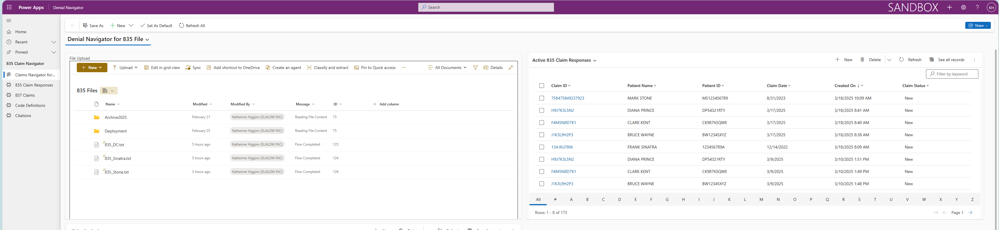
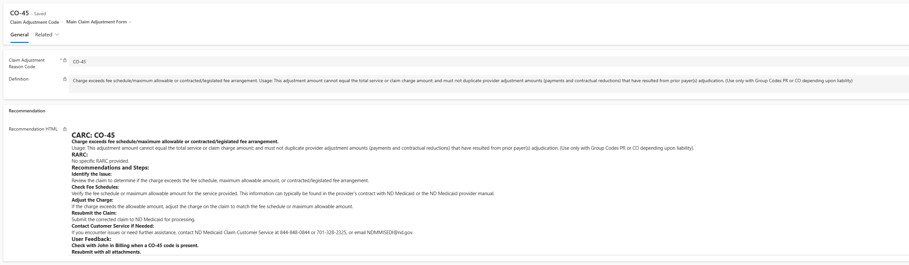

# Denial Navigator 

## Summary

Denial Navigator is an AI tool designed to help rural hospitals address and resolve denied Medicare, Medicaid, and Commercial Insurance claims. It simplifies the process by providing recommendations that align with payer guidelines, allowing the upload of 835 and 837 files with automation options, suggesting adjustments for denied claims, and presenting claim data in a review-friendly format. The tool was developed to alleviate the financial burden on hospitals, which spend nearly $20 billion annually on appealing denials. In 2023, denials issued by commercial MA plans rose sharply by 55.7%, and for other commercial payers, claims denials increased by 20.2%. The development of Denial Navigator is part of Microsoft's Rural Health AI Innovation Lab (RHAIL) initiative, which aims to collaborate with rural customers in developing innovative AI solutions for rural health challenges. The goal is to drive technology advancement, improve financial performance, and address health disparities unique to the patients and communities served
### Click to Watch a Video Overview
[](https://www.youtube.com/embed/KfOhLt07fic?si=_t_XY42PBeXxvp21)






## Licensing requirements
* Power Apps license.


See also: [Licensing overview for Power Platform](https://github.com/MicrosoftDocs/powerapps-docs/blob/main/power-platform/admin/pricing-billing-skus)

## Applies to

* [Microsoft Power Apps](https://docs.microsoft.com/powerapps/)


## Compatibility


## Authors


Solution|Author(s)
--------|---------
azureresources | [RHAIL Team](LinkToYourGitHubProfile), Microsoft
data | [RHAIL Team](LinkToYourGitHubProfile), Microsoft
solution | [RHAIL Team](LinkToYourGitHubProfile), Microsoft

## Version history

Version|Date|Comments
-------|----|--------
1.0|March 1, 2025|Initial release

## Features

This solution does the following:

* Parses 835 text files
* Interacts with your own instance of Azure Open AI to generate reccomendations
* Inserts data in to Dataverse tables

## Prerequisites

> Before installing the solution, the following Azure Resources need to be created 
* Azure Open AI Model
* Azure Storage Account
* Azure AI Search Service

The resources can be created by using the Powershell script found in the [*azureresources*](/azureresources/) folder of this repo. 

> A Sharepoint document library will also need to be created. This is where you will upload files to kick off the processes in this solution.

The SharePoint library should have the following structure :

|Type|Internal Name|Required|
|---|---|:---:|
|Single line of text|Name|Yes|
|Multiple lines of text|Message|Yes|
|Datetime|Modified|Yes|
|Person|ModifiedBy|Yes|

## Solution Components

The following solution components are used in this sample:

### Model Driven App 
* Denial Navigator
### Cloud Flows
* DenialNavigator_AddFeedback
* DenialNavigator_ArchiveFiles
* DenialNavigator_Child_GetRec
* DenialNavigator_Child_Parse835Claims
* DenialNavigator_Child_Parse837Claims
* DenialNavigator_Child_ParseHeader835
* DenialNavigator_MainProcessFlow
### Environment variables
* Azure Blob Storage Name
* Azure Search Service API Key
* Azure Search Service URL
* AzureOpenAi API Key
* AzureOpenAi API URL
* Parse Index
* Recs Index
* Sharepoint Doc Site
* Sharepoint Library Name
### Connection references
* Azure Blob Storage DenialNavigator Conn
* Content Conversion
* Microsoft Dataverse
* Sharepoint

## Data Sources

### Code Defintions
CARC and RARC code definitions can be uploaded to the Dataverse table using the CSV in the [*data*](./data/rhail_codedefinitions.csv) folder

## Minimal Path to Awesome

* [Download](./azureresources/) files in **azureresources** folder.
* Replace parameter values in **AddResource.ps1** with your own and run the script.
* [Download](./solution/RHAILUnmanaged.zip) the solution `.zip` from the `solution` folder
* Within **https://make.powerapps.com**, import the `.zip` file via **Solutions** > **Import solution** > **Browse** and select the `.zip` file you just downloaded.
* Click next. Create required connections and fill out enviormental variables values.
* Submit and import solution.

## Using the Source Code

You can also use the [Power Apps CLI](https://aka.ms/pac/docs) to pack the source code by following these steps::

* Clone the repository to a local drive
* Pack the source files back into `.zip` file:
  ```bash
  pac solution pack --folder pathtosourcefolder --zipfile pathtosolution  --processCanvasApps
  ```
  Making sure to replace `pathtosourcefolder` to point to the path to this sample's `sourcecode` folder, and `pathtosolution` to point to the path of this solution's `.zip` file (located under the `solution` folder)
* Within **https://make.powerapps.com**, import the `.zip` file via **Solutions** > **Import solution** > **Browse** and select the `.zip` file you just downloaded.
* Click next.
* ...

## Disclaimer

**THIS CODE IS PROVIDED *AS IS* WITHOUT WARRANTY OF ANY KIND, EITHER EXPRESS OR IMPLIED, INCLUDING ANY IMPLIED WARRANTIES OF FITNESS FOR A PARTICULAR PURPOSE, MERCHANTABILITY, OR NON-INFRINGEMENT.**

## Help

This repository is intended as a starting point for developers. It provides a base structure to help you begin coding quickly, but it is not actively maintained, and support will not be provided through GitHub. We do not offer assistance for issues or questions related to this base. However, you're welcome to explore, modify, and build upon it as needed. While we won’t be responding to GitHub issues or questions, the broader developer community is often generous with their time and may be able to help if you share your questions elsewhere (e.g., Stack Overflow, forums, or Discord groups).


## For more information

- [Overview of creating apps in Power Apps](https://docs.microsoft.com/powerapps/maker/)
- [Power Apps canvas apps documentation](https://docs.microsoft.com/en-us/powerapps/maker/canvas-apps/)


